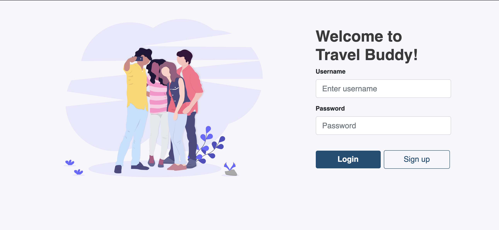
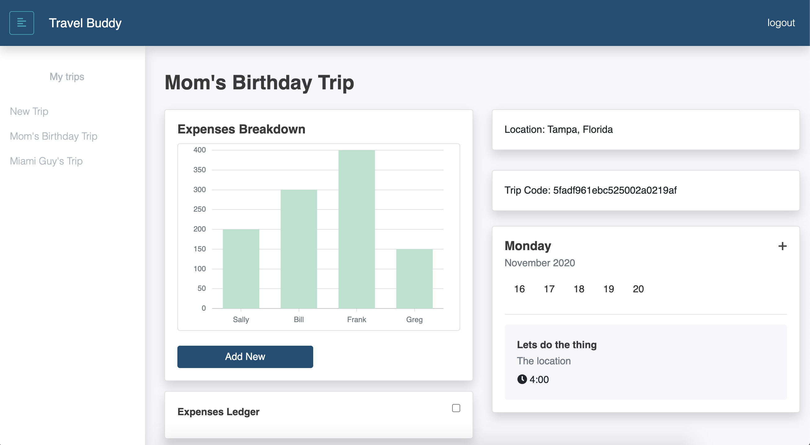

# Travel Buddy

## Deployed Link: https://travel-buddy3.herokuapp.com/
---
## Presentation Link: https://docs.google.com/presentation/d/1CS7D2iKeuRIBoriYfBAl9Zv5GmGy4G7Yd5nZ5UsO85A/edit?usp=sharing
---


## Description

  *The what, why, and how:*

`PROJECT DESCRIPTION:` Travel buddy is a multi-user trip tracking application where users can create, store, and share information with others about upcoming trips. Users are able to track their spending, split costs, and add/view events to their itinerary for each day of their trip! This is our final project for UPenn's Coding Boot Camp.




  ---


## Table of Contents

  - [Deployed Site](#deployed-link)
  - [Presentation](#presentation-link)
  - [Description](#description)
  - [Usage](#usage)
  - [Technologies](#technologies)
  - [Directory Structure](#directory-structure)
  - [Questions](#questions)
 
 ---


## Usage
  *Instructions and examples for use:*

To run this application:
1. Visit the deployed link above

2. Create a new account and add a trip!

3. Invite your friends to join your trip by sharing your 'trip code' or join a friend's trip by typing in their access code


---


## Technologies
*Technologies used in this project:*
 - Javascript
 - Node.js
 - Reat.js
 - MongoDB/Mongoose
 - Passport.js
 - Bcrypt
 - React
 - React-Bootstrap
 - Express
 - Axios
 - Heroku

 ---
 

## Directory Structure
```
├── node_modules
│ 
├── client
│   └── >public
│   └── >src  
│       └── >components
│           └── >Budget
│           └── >Content
│           └── >Display
│           └── >FriendLedger
│           └── >FriendPill
│           └── >Friends
│           └── >Itinerary
│           └── >log-in
│           └── >Main
│           └── >NavBar
│           └── >NewTrip
│           └── >SideBar
│           └── >Sign-up
│       └── >contexts
│           └── auth-provider.js
│       └── >pages
│           └── Dashboard.js
│           └── Log-Sign.js
│           └── Login.js
│           └── NewTrip.js
│       └── >utils
│           └── API.js
│       └── App.js
│       └── index.js
├── package.json
├──>controllers
│   └── tro[Controllers.js 
│  
├──>models
│   └── trip.js
│   └── user.js
│   └── index.js  
│   
├──>passport
│    └── index.js
│    └── localStrategy.js
│  
├──>routes
│    └── index.js
│    └── trip.js
│    └── user.js
│ 
├──>scripts
│    └── seedDB.js
│ 
├── package.json
│ 
├── database.js
│ 
├── >rmImgs
│ 
├── package.json
│ 
├── server.js
│ 
└── README.md
```

---


## Questions?

  *For any questions about this application, please contact me via the information below:*

  * **GitHub:** https://github.com/rachelkline
  
  * **Email:** rachel_kline@icloud.com

---
  <br>

  [Icons provided by https://fontawesome.com/]